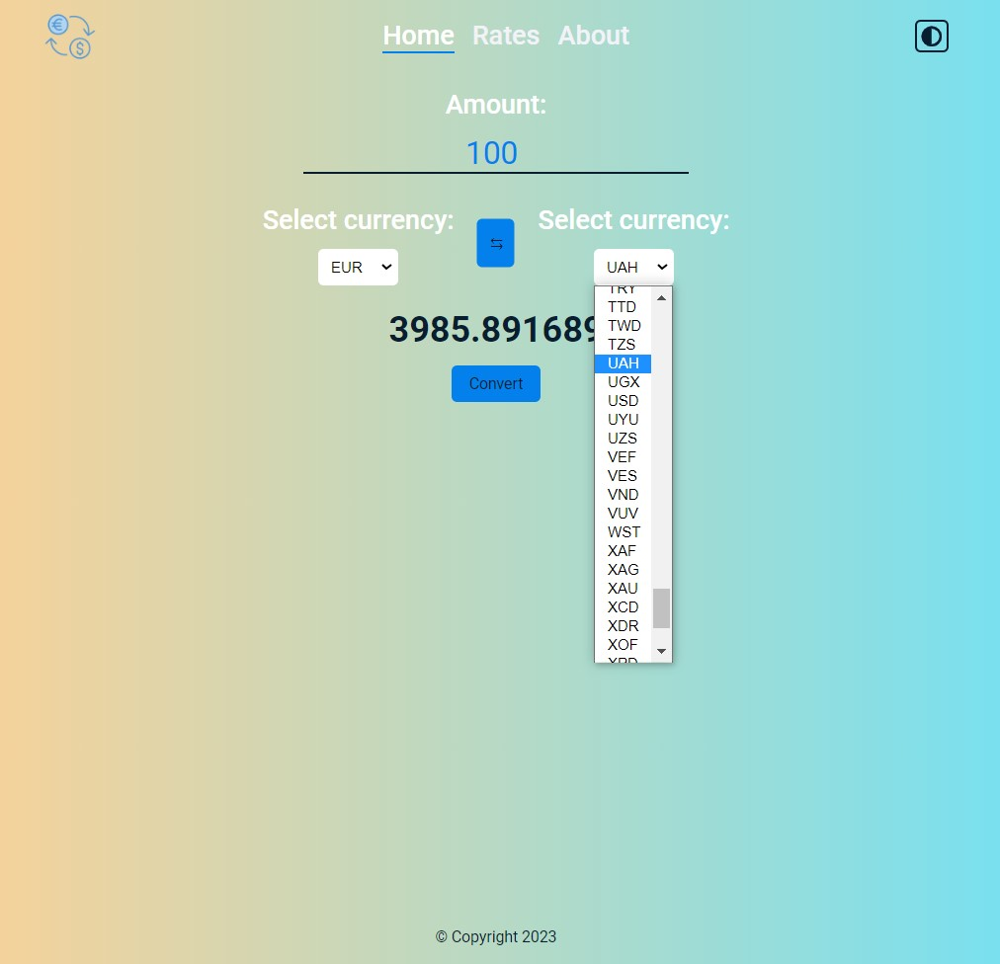
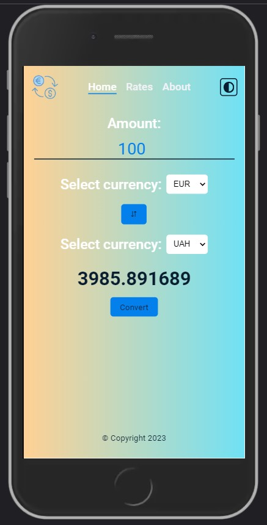
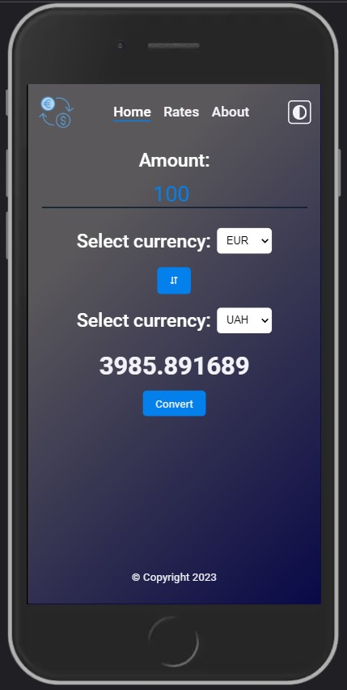

# Currency convertor application.

This project was bootstrapped with [vite](https://vitejs.dev/guide/#scaffolding-your-first-vite-project).

<ins>App Preview:</ins>

## Available Scripts

In the project directory, you can run:

### `npm install`  

or

### `pnpm install`  

to instal all dependencies in this project.

### `npm run dev`

to run the app in the development mode. 
Open [http://127.0.0.1:5173](http://127.0.0.1:5173) to view it in the browser.

### `npm run test`

to run the app tests.
